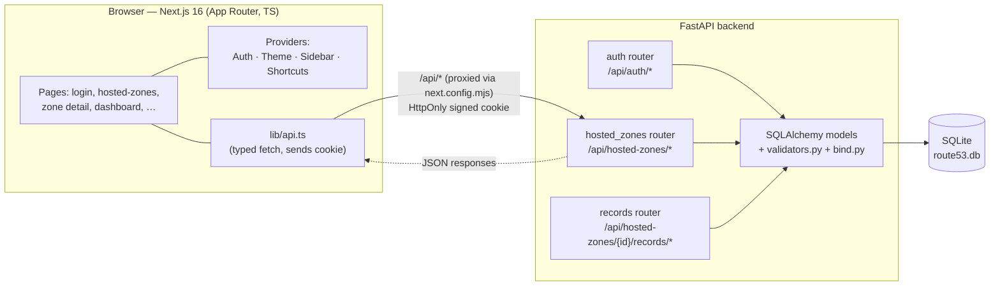
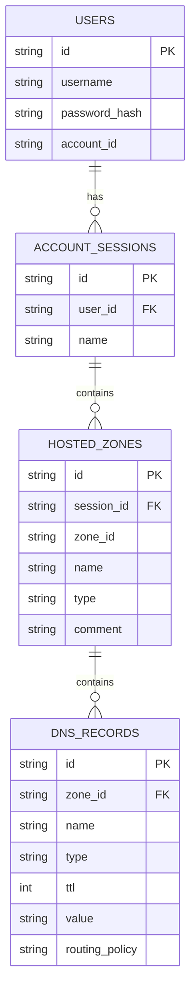

# Route 53 Clone

A working re-creation of the **AWS Route 53** console. The goal here isn't to run
real DNS — resolution is mocked — but to reproduce the Route 53 experience as
closely as possible: the navigation, the data tables, the create flows, the
filtering, and full CRUD on hosted zones and DNS records, all backed by a real
API and a persistent database.

| Layer    | Technology                            |
| -------- | ------------------------------------- |
| Frontend | Next.js 16 (App Router) + TypeScript  |
| Backend  | FastAPI (Python)                      |
| Database | SQLite via SQLAlchemy                 |
| Auth     | Mocked, signed-cookie sessions        |

**Repository:** https://github.com/SourishOP/aws-route53-clone

**Live demo:** https://aws-route53-clone-nu.vercel.app
Sign in with `admin` / `admin`. (The backend runs on Render's free tier, so the
first request after a period of inactivity may take ~50 seconds to wake.)

---

## Contents

1. [Features](#features)
2. [Project layout](#project-layout)
3. [Running it locally](#running-it-locally)
4. [How it fits together](#how-it-fits-together)
5. [Database schema](#database-schema)
6. [API reference](#api-reference)
7. [Deployment](#deployment)
8. [Demo login & seed data](#demo-login--seed-data)

---

## Features

### Sign-in and sessions
The login mirrors the real AWS flow in three steps. You enter credentials first,
then land on a **Choose AWS sessions** screen, and finally pick a session to enter
the console. A session here is a self-contained workspace under the one account —
you can add new ones from the sign-in screen, and each keeps its **own** set of
hosted zones. Switching sessions switches the data you see; nothing bleeds across.
The signed-in state survives a page refresh (it rides on an HttpOnly cookie), and
signing out clears it and sends you back to the credentials screen. Any attempt to
open an app route while signed out bounces to login.

### Hosted zones
Full CRUD, scoped to the active session:
- Browse zones in an AWS-style table with sortable columns, a working pager, and
  live record counts.
- Create a zone from a dedicated full-page form (domain name, description, public
  or private). As Route 53 does, a brand-new zone is seeded with its starter **NS**
  and **SOA** records automatically.
- Edit a zone's description, or select one or several rows and delete them in bulk
  (with a confirmation step). Deleting a zone also removes all of its records.

### DNS records
Full CRUD on the records inside a zone, with the common Route 53 types supported:
**A, AAAA, CNAME, TXT, MX, NS, PTR, SRV, CAA** (plus SOA for the zone default).
Each value is validated for its type before it's saved — an A record has to be a
real IPv4 address, AAAA an IPv6 address, MX needs a priority and a target, SRV
needs its four fields, and so on. Bad input comes back as a readable error instead
of silently saving garbage. You can filter the record list by name, type, or value.

### The property filter
The search box on the zones and records tables works like the real console's
property filter rather than a plain text input. Click it, pick a property (Type,
Created by, Record count, and so on), and that property drops into the bar as a
prompt; type a value and it becomes a dismissible token. Tokens stack and combine,
and the table filters through the backend as you go.

### Import and export
- **Import** DNS records into a zone by pasting a BIND zone file (or choosing one).
  The parser understands `$TTL`/`$ORIGIN`, `@`, relative and absolute names, and
  the supported record types; it reports how many records were created and skipped.
- **Export** a zone as either JSON or a BIND zone file — both download straight
  from the browser.

### Console niceties
- A dark top navigation with a working app-launcher grid, a Route 53 service
  search panel, a CloudShell placeholder, and a notifications tray populated with
  sample account activity.
- **Light and dark themes** that you can flip from the toolbar or the account menu
  (the choice is remembered and also follows your system preference on first load).
- **Keyboard shortcuts** — `Alt+S` to jump to search, `/` to focus the current
  filter, `g h` / `g d` / `g c` to navigate, `c` to create, `Shift+D` for the
  theme, and `?` for the shortcut cheat-sheet.
- Toast notifications for the outcome of create/edit/delete actions, confirmation
  modals for destructive steps, and tidy empty states throughout.

### The rest of the console
Every item in the Route 53 sidebar — Dashboard, Health checks, Profiles, the
Resolver and Domains groups, Traffic flow, CIDR collections, and so on — resolves
to a real, console-styled page rather than a dead link or a 404.

---

## Project layout

```
Scalar/
├── backend/                     # FastAPI + SQLAlchemy + SQLite
│   ├── app/
│   │   ├── main.py              # App setup, CORS, startup/seed
│   │   ├── database.py          # Engine + session factory
│   │   ├── models.py            # ORM: User, AccountSession, HostedZone, DnsRecord
│   │   ├── schemas.py           # Pydantic request/response models + type checks
│   │   ├── validators.py        # Per-type DNS value validation
│   │   ├── bind.py              # BIND zone-file parser and renderer
│   │   ├── auth.py              # Signed-cookie session helpers + dependencies
│   │   ├── utils.py             # Route 53-style zone-id generator
│   │   ├── seed.py              # Default user, session, and sample zones
│   │   └── routers/
│   │       ├── auth.py          # /api/auth/* incl. session workspaces
│   │       ├── hosted_zones.py  # /api/hosted-zones* incl. import/export
│   │       └── records.py       # /api/hosted-zones/{id}/records*
│   └── requirements.txt
│
└── frontend/                    # Next.js (App Router) + TypeScript
    ├── src/
    │   ├── app/                 # Routes (login, hosted-zones, dashboard, …)
    │   ├── components/          # Shell, TopNav, Sidebar, PropertyFilter,
    │   │                        #   modals, providers (Theme/Sidebar/Shortcuts)
    │   └── lib/                 # API client, types, nav model, helpers
    ├── next.config.mjs          # Proxies /api/* to the backend
    └── package.json
```

---

## Running it locally

You'll need **Node.js 18+** and **Python 3.11+**. Run the two halves in separate
terminals.

### Backend

```bash
cd backend

# create + activate a virtual environment
python -m venv .venv
# Windows (PowerShell)
.\.venv\Scripts\Activate.ps1
# macOS / Linux
source .venv/bin/activate

pip install -r requirements.txt

# start the API on http://127.0.0.1:8000
python -m uvicorn app.main:app --host 127.0.0.1 --port 8000
```

On first launch the backend creates `route53.db`, adds the demo user, a default
session, and a few sample zones. Interactive API docs live at
`http://127.0.0.1:8000/docs`.

### Frontend

```bash
cd frontend
npm install
npm run dev        # http://localhost:3000
```

The frontend proxies every `/api/*` call to the backend, so both need to be
running. Open `http://localhost:3000` and sign in with the demo credentials below.
Use `http://localhost:3000` (not `127.0.0.1`) so the session cookie behaves.

Production build:

```bash
npm run build
npm run start
```

---

## How it fits together



**Frontend.** Pages live under `src/app` using the App Router. A set of context
providers wraps the authenticated shell: `AuthProvider` restores the session on
load and guards routes, `ThemeProvider` toggles light/dark, `SidebarProvider`
tracks the collapse state, and `ShortcutsProvider` wires the keyboard commands.
`lib/api.ts` is a thin typed `fetch` wrapper that always sends the cookie and
surfaces readable error messages. `next.config.mjs` rewrites `/api/*` to the
backend so the browser treats everything as same-origin.

**Backend.** A FastAPI app with three routers (auth, hosted zones, records).
SQLAlchemy models carry the relationships — a user has many sessions, a session
has many zones, a zone has many records — with cascading deletes down the chain.
Auth is deliberately simple: login signs a cookie (via `itsdangerous`) that holds
the user id and the active session id; protected endpoints depend on helpers that
read it back. Record values are validated per type in `validators.py`, and BIND
import/export is handled in `bind.py`. The database is seeded on startup so the
app is usable immediately.

**Session scoping.** The active session id travels in the signed cookie. Every
hosted-zone query filters on it and every new zone is stamped with it, which is
what keeps each workspace's data isolated.

---

## Database schema

SQLite (`route53.db`), four tables. The relationships at a glance:




### `users`
| Column          | Type     | Notes                       |
| --------------- | -------- | --------------------------- |
| `id`            | TEXT PK  | UUID                        |
| `username`      | TEXT     | Unique, indexed             |
| `password_hash` | TEXT     | PBKDF2 (passlib)            |
| `account_id`    | TEXT     | Mocked AWS account id       |
| `created_at`    | DATETIME |                             |

### `account_sessions`
| Column       | Type     | Notes                                  |
| ------------ | -------- | -------------------------------------- |
| `id`         | TEXT PK  | UUID                                   |
| `user_id`    | TEXT FK  | → `users.id` (cascade delete)          |
| `name`       | TEXT     | Workspace name, e.g. "First Principles"|
| `created_at` | DATETIME |                                        |

### `hosted_zones`
| Column       | Type     | Notes                                       |
| ------------ | -------- | ------------------------------------------- |
| `id`         | TEXT PK  | UUID (used internally and in URLs)          |
| `session_id` | TEXT FK  | → `account_sessions.id` (cascade delete)    |
| `zone_id`    | TEXT     | Route 53-style id, e.g. `Z1D633PJN98FT9`    |
| `name`       | TEXT     | Domain name, normalized with a trailing dot |
| `type`       | TEXT     | `Public` or `Private`                       |
| `comment`    | TEXT     | Description                                 |
| `private`    | BOOLEAN  | Derived from `type`                         |
| `created_at` | DATETIME |                                             |
| `updated_at` | DATETIME |                                             |

### `dns_records`
| Column           | Type     | Notes                                           |
| ---------------- | -------- | ----------------------------------------------- |
| `id`             | TEXT PK  | UUID                                            |
| `zone_id`        | TEXT FK  | → `hosted_zones.id` (cascade delete)            |
| `name`           | TEXT     | Record name                                     |
| `type`           | TEXT     | A, AAAA, CNAME, TXT, MX, NS, PTR, SRV, CAA, SOA |
| `ttl`            | INTEGER  | Seconds                                         |
| `value`          | TEXT     | One or more values (newline-separated)          |
| `routing_policy` | TEXT     | Defaults to `Simple`                            |
| `created_at`     | DATETIME |                                                 |
| `updated_at`     | DATETIME |                                                 |

**Relationships:** `User` → many `AccountSession` → many `HostedZone` → many
`DnsRecord`. Deletes cascade all the way down.

---

## API reference

Base URL: `http://127.0.0.1:8000` (or `/api/*` through the frontend proxy).
Everything except `login` requires a valid session cookie.

### Auth & sessions
| Method | Path                          | Description                               |
| ------ | ----------------------------- | ----------------------------------------- |
| POST   | `/api/auth/login`             | Log in; sets the session cookie           |
| POST   | `/api/auth/logout`            | Log out; clears the cookie                |
| GET    | `/api/auth/me`                | Current user (used to restore the session)|
| GET    | `/api/auth/sessions`          | List the account's sessions (with counts) |
| POST   | `/api/auth/sessions`          | Create a new session/workspace            |
| POST   | `/api/auth/sessions/activate` | Make a session the active one             |

### Hosted zones (scoped to the active session)
| Method | Path                                | Description                                   |
| ------ | ----------------------------------- | --------------------------------------------- |
| GET    | `/api/hosted-zones`                 | List (query: `search`, per-property filters, `page`, `page_size`, `sort`, `order`) |
| POST   | `/api/hosted-zones`                 | Create a zone (auto-adds NS + SOA)            |
| GET    | `/api/hosted-zones/{id}`            | Get one zone                                  |
| PUT    | `/api/hosted-zones/{id}`            | Update the description                        |
| DELETE | `/api/hosted-zones/{id}`            | Delete a zone and its records                 |
| POST   | `/api/hosted-zones/{id}/import`     | Import records from a BIND zone file          |
| GET    | `/api/hosted-zones/{id}/export`     | Export as JSON or BIND (`?format=json\|bind`) |

### DNS records (scoped to a zone)
| Method | Path                                               | Description                                   |
| ------ | -------------------------------------------------- | --------------------------------------------- |
| GET    | `/api/hosted-zones/{zone_id}/records`              | List (query: `search`, `type`, per-property filters, `page`, `page_size`, `sort`, `order`) |
| POST   | `/api/hosted-zones/{zone_id}/records`              | Create a record (value validated by type)     |
| GET    | `/api/hosted-zones/{zone_id}/records/{record_id}`  | Get one record                                |
| PUT    | `/api/hosted-zones/{zone_id}/records/{record_id}`  | Update a record (value re-validated)          |
| DELETE | `/api/hosted-zones/{zone_id}/records/{record_id}`  | Delete a record                               |

### Health
| Method | Path          | Description    |
| ------ | ------------- | -------------- |
| GET    | `/api/health` | Liveness check |

**Status codes:** `200` on success, `201` on create, `204` on delete, `401` when
unauthenticated, `404` for a missing resource, `409` on a duplicate name,
and `422` when a record value fails its type validation.

**List response shape:**
```json
{
  "items": [ /* ... */ ],
  "total": 42,
  "page": 1,
  "page_size": 10
}
```

Full OpenAPI/Swagger docs are served at `http://127.0.0.1:8000/docs`.

---

## Deployment

The app is split in two, so each half is hosted on the platform that suits it:

- **Frontend → Vercel.** Vercel is built for Next.js, so the App Router build,
  routing, and env-based config work out of the box with zero extra setup, and the
  free tier is plenty for a demo.
- **Backend → Render.** Render runs a long-lived Python/uvicorn process directly
  from the repo (unlike Vercel's serverless model, which doesn't suit a stateful
  FastAPI + SQLite server), again on a free tier.

The two talk over HTTPS: the frontend proxies `/api/*` to the Render backend
(set via a `BACKEND_URL` env var), and the backend allows the Vercel origin for
CORS and uses a cross-site session cookie so login works across the two domains.
A `render.yaml` blueprint in the repo captures the backend's build/start commands
and environment so it's reproducible.

One trade-off worth noting: the backend uses SQLite on the instance's local disk,
and Render's free tier has an ephemeral filesystem — so the database resets (and
reseeds the sample data) whenever the instance restarts or wakes from idle. That's
fine for a demo; for durable storage you'd attach a persistent disk or move to a
hosted database.

---

## Demo login & seed data

**Credentials**
- Username: `admin`
- Password: `admin`

(Both are prefilled on the sign-in screen.)

**Seeded data:** two sessions are created under the account so you can see the
per-session isolation right away:

- **First Principles** — `example.com.`, `myapp.io.`, `internal.local.`
- **Production Account** — `acme-corp.com.`, `shop-acme.net.`, `vpc-internal.aws.`

Each zone comes with starter records (NS, SOA, A, CNAME, MX). Pick one session on
the sign-in screen, note its zones, then sign out and pick the other — the two show
completely different hosted zones, which is the point of the session scoping.
